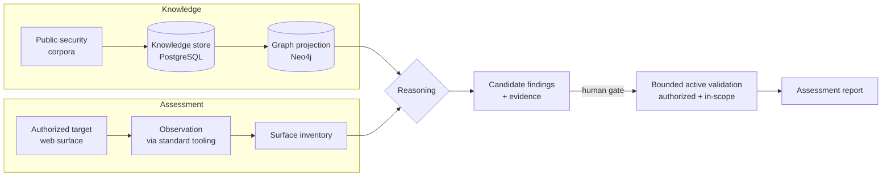

# 🜃 Cyber Umbra

### Offensive security at machine speed — with a human holding the leash.

**Cyber Umbra turns the entire public body of web-security knowledge into a reasoning engine
that hunts for weaknesses on systems you're authorized to test — and never pulls a trigger
without you.**

---

> ### ⚠️ Public BETA preview
> This repository is an **intentionally limited beta**, published to show where the project
> is going. **The production version is substantially more advanced** and is **not** here:
> the reasoning engine, the authorization core, the machine-learning models, the
> active-validation subsystem and the proprietary datasets are all private. What you're
> reading is the **architecture and the vision** — not a tool you can run.

---

## The problem

A web pentest is a race against time. The attack surface is enormous, the relevant
knowledge — tens of thousands of weaknesses, attack patterns and advisories — is scattered
across corpora no human can hold in their head, and the clock on an engagement is always
running. So testers triage: they chase what they remember, and the long tail goes
unexamined.

The obvious fix — "just automate it" — is how people end up with reckless scanners that
either drown you in false positives or, far worse, take destructive actions no one
authorized.

## The idea

**Neither a human alone nor a machine alone. Both, in the right order.**

Cyber Umbra gives a security professional an engine that has *actually read* the public
knowledge base, projects it into a graph it can reason over, observes an authorized
target, and surfaces the **candidate** weaknesses worth a human's attention — ranked,
evidenced, and explained. The human decides what happens next. Every consequential step is
gated.

It's **semi-autonomous by design**: the autonomy is in the *search*, the judgment stays
with *you*.

## What it does

- **Ingests** the open security canon — weakness taxonomies, attack patterns, public
  advisories — with full provenance, as verifiable knowledge rather than a pile of text.
- **Builds a graph** connecting techniques, weaknesses and the signals that reveal them,
  so the system can reason about *paths*, not just match strings.
- **Observes** an authorized target's web surface through standard, well-behaved tooling,
  producing an evidenced map of what's really there.
- **Reasons** over knowledge + observation to propose **candidate** findings a human finds
  worth their time — with the evidence attached.
- **Reports** to the human, who authorizes any active step, bounded and in-scope.

## Why it's different

| Most automation | Cyber Umbra |
|---|---|
| Pattern-matches and hopes | Reasons over a knowledge **graph** |
| "Vulnerable / not vulnerable" | An **epistemic lifecycle**: a lead is a *candidate* until a human confirms it |
| Acts first, asks never | **Two human gates** — nothing active happens without authorization |
| Safety in a disclaimer | **Safety enforced in code** |
| Black box | Provenance on every fact, evidence on every claim |

## The objective

Make a single skilled operator as thorough as a team — finding, on authorized engagements,
the weaknesses that would otherwise stay in the long tail — **without ever trading away the
human judgment and authorization that separate security work from an attack.**

Web first. Done right. Then everything else.

## Architecture at a glance

Deeper: [`docs/ARCHITECTURE.md`](docs/ARCHITECTURE.md) ·
[`docs/GOVERNANCE.md`](docs/GOVERNANCE.md) · [`docs/ROADMAP.md`](docs/ROADMAP.md)

## Built to be trusted

Safety is treated as **code, not prose**: two human authorization gates, analysis before
action, *candidate ≠ confirmed*, machine learning that never confirms a finding on its own,
and ingested content handled as untrusted data. The point of a public preview is to show
you can build offensive-security automation **responsibly** — see
[`docs/GOVERNANCE.md`](docs/GOVERNANCE.md).

## Technology

**PostgreSQL** (knowledge source of truth) · **Neo4j** (graph reasoning) · **Python** (core)
· **Machine learning** (ranking & relationship inference — never autonomous confirmation).

## Scope & ethics

For **authorized, contracted, in-scope** engagements only. Testing systems without explicit
written permission is illegal. **This repository contains no exploit code** — it's about
architecture and governance, not weaponization.

## What is deliberately **not** in this repository

The production reasoning and authorization engine · the ML models and pipeline · the
active-validation subsystem · proprietary datasets, engagement data and internal tooling.

## Author & license

© 2026 **Asier Augusto**. All Rights Reserved — see [`LICENSE`](LICENSE).

Published for public viewing only. Viewing it grants **no** right to use, copy, modify or
redistribute. Not accepting external contributions at this stage.
